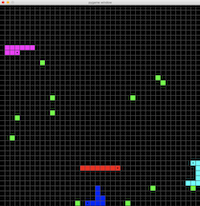
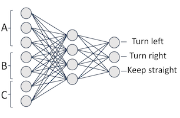
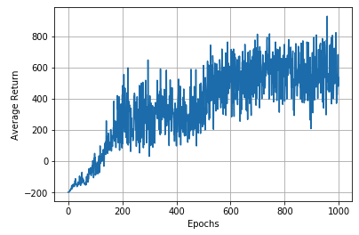

# SLITHERIN'

### Motivation
The primary motivation behind this project is to assess the behaviour that agents acquire in a multiplayer snake game environment when trained using a reinforcement learning algorithm with self-play. Also, this project tries to tackle the challenge termed Slitherin’  in the openai's "request for research 2.0".


### The Environment
The environment, built with pygame as a Gym environment, consists of a 40x40 2D grid with fruits and snakes. Snakes increase in length when they eat(collide against) fruits and a new fruit appears at a random grid position whenever any fruit is eaten. Snakes die when they collide with the walls, themselves or other snakes. When a snake dies, it turns into fruits. The game ends when all snakes die.<br/>
An agent's observation is designed in such a way that it always seems to be moving northward. This gives it a choice of just 3 actions; turn left, turn right, and keep straight. An observation, for an agent,  is a tuple consisting of the obstacles in front of and beside its head position, closest opponent’s position relative to the head and closest food position relative to the head. <br/>
An agent gets a reward of +30 when it eats a fruit and -100 if it dies. The environment is solved with an overall score of 500 for 2 agents and 1000 for 4 agents.

### Approach
The environment was solved using a reinforcement learning algorithm with self-play

algorithm: PPO (Proximal Policy Optimization)<br/>
<a href="https://ibb.co/gRvfnR7"></a>

policy network: MLP<br/>


Exploration curriculum: This enables the agents to learn the skills necessary to behave well in the environment by giving the agents little rewards for taking the right actions. This rewards decay over time. Hence, an exploration reward of +1 was given to the agent for any action that moved it closer to the closest fruit.

plot showing the average return at each epoch for a training experiment.


Learned Behaviour:

- When 2 agents were trained with exploration curriculum, they both learnt to always go for the nearest fruit and avoid the walls and each other when in range.
- For 2 agents, when trained without exploration curriculum, One agent learnt to always chase and eat the fruits while the other learnt to run towards the fruits without actually eating any (probably for the fear of the other agent's presence) with the goal of taking out the other agent when it comes around.
- For 4 agents, 2 of the agents learnt to curl around a fruit, preventing other agents from eating that particular fruit and causing them to die by collision when they attempt to eat the fruit. The other 2 agents learnt to always chase the fruit.


### Prerequisites
  - Tensorflow (2.0)
  - pygame

### Installation
1. Clone the repository
  ```Shell
  git clone https://github.com/ldfrancis/OpenAI-Requests-for-Research-2.0.git
  ```
2. Go to the SLITHERIN' directory
  ```Shell
  cd "Slitherin'"
  ```
3. Install gym_slitherin
  ```Shell
  pip install -e .
  ```
  
### Usage
1. Train agents: while in the Slitherin directory,
  ```Shell
  python train.py --env 4 --render --model train_agents
  ```
  This instantiates an environment with 4 snakes and renders the environment while training networks to be saved in the folder 'train_agents' to solve the environment
  
2. Test trained policies: while in the SLITHERIN' directory,
  ```Shell
  python policy_test.py --env 4 --model train_agents
  ```
  This instantiates an environment with 4 snakes and renders the environment while taking agents' action from a policy network saved in the folder 'train_agents'.


## OpenAI Requests for Research 2.0

[**SLITHERIN’:**](https://openai.com/blog/requests-for-research-2/) ⭐⭐

This challenge involves Implementing and solving a multiplayer clone of the classic Snake game as a Gym environment.

The environment is specified to be one that has a large field with multiple snakes with each snake being able to eat randomly appearing fruits while avoiding any form of collision with all snakes (including itself) and the walls. The game ends when all snakes are dead.

The environment is to be solved using self-play and the learned behaviour of the agent is to be inspected to see if it tries to completely search for food, try to attack other snakes or just avoid collision.
